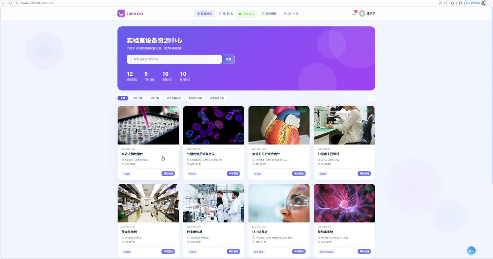
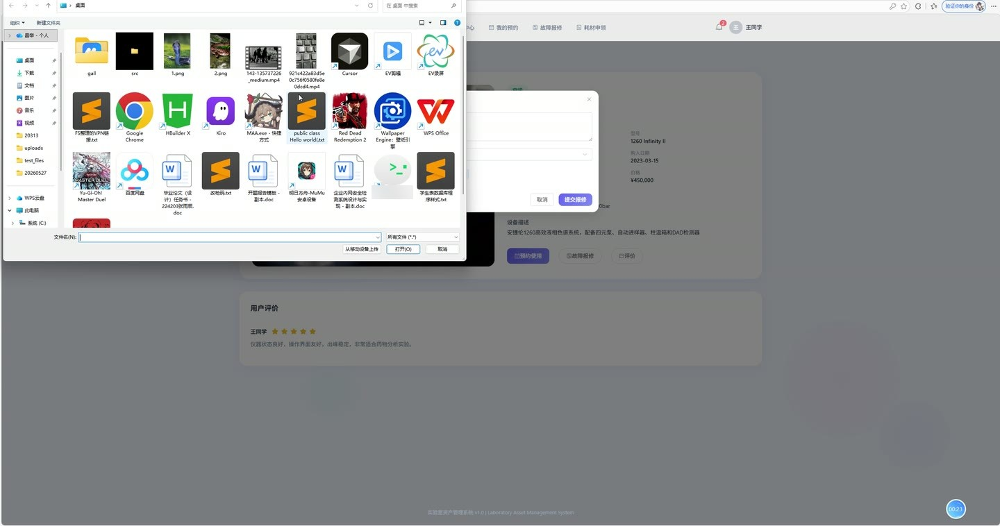
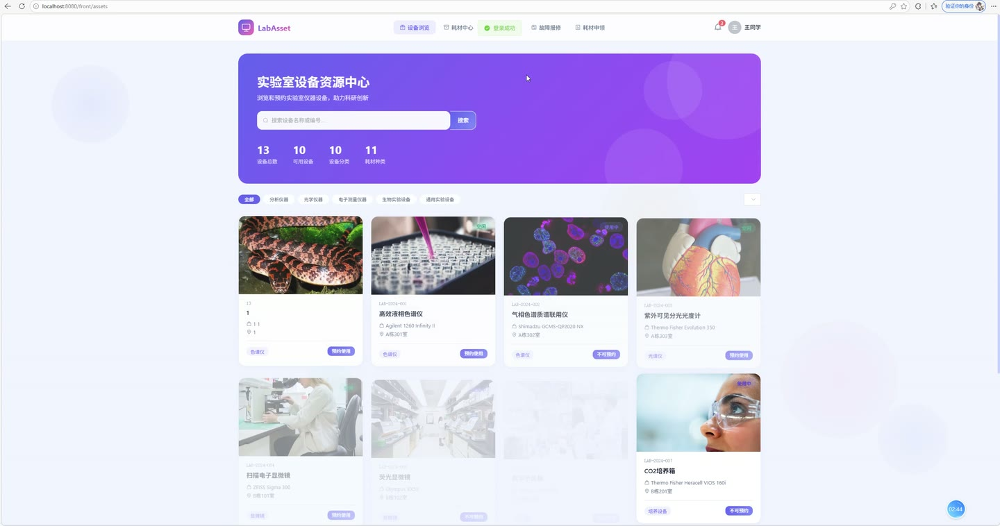
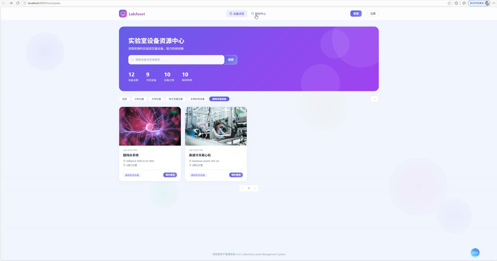
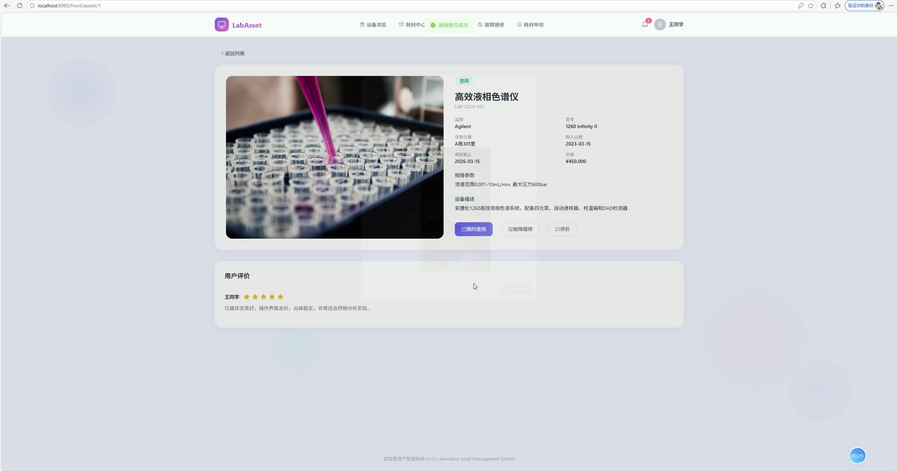
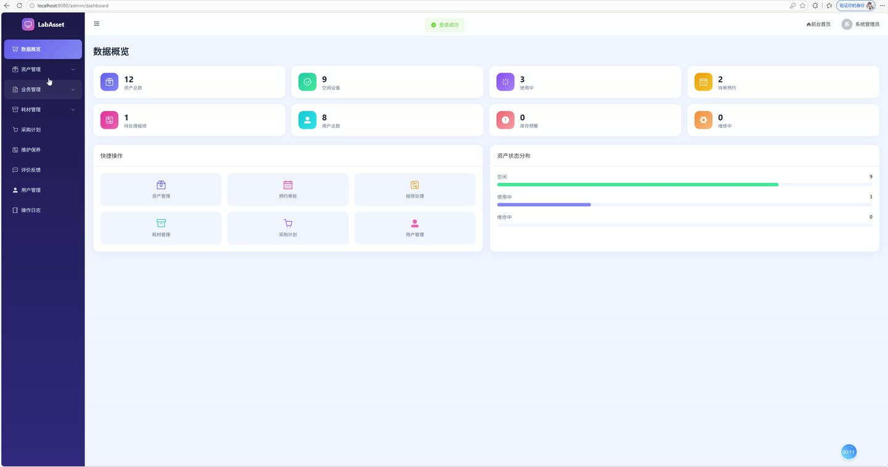

# (附文档)Springboot3+Vue3+MySQL 实验室资产管理系统

**技术栈**：Springboot3、Vue3、MySQL

### 系统简介

本系统是一款基于 SpringBoot3 + Vue3 + MySQL 构建的实验室资产管理系统，采用前后端分离架构，覆盖资产全生命周期管理。系统包含普通用户端与管理员端两大角色，提供资产信息管理、预约借用、维修报障、耗材申领、采购计划、保养计划、使用记录、反馈评价、消息通知等完整业务闭环，适用于高校实验室、科研机构及企业内部实验室的数字化管理需求。
 
### 核心功能
 
### 普通用户端

 
- 用户注册与登录：支持新用户在线注册，填写用户名、密码、真实姓名、手机号、邮箱及所属院系/部门，注册成功后自动分配普通用户角色 
- 资产浏览与查询：查看实验室全部资产列表，支持按关键词（资产名称/资产编号）、资产分类、资产状态（空闲/使用中/维修中）进行筛选，分页展示 
- 资产详情查看：点击资产卡片进入详情页，查看资产编码、品牌型号、规格参数、采购价格、购置日期、保修截止日期、存放位置、当前状态及资产图片 
- 耗材浏览与库存查询：查看实验室耗材列表，支持按耗材名称搜索，展示耗材编码、分类、单位、当前库存量、预警库存阈值、单价及图片 
- 资产预约申请：选择需要预约的资产，填写预约开始时间、结束时间及使用用途，提交后状态为待审批，可在"我的预约"中查看审批进度 
- 我的预约管理：查看个人全部预约记录，展示资产名称、预约时间段、用途及审批状态（待审批/已通过/已拒绝/已取消），支持取消未审批的预约 
- 维修报障提交：针对故障资产提交维修工单，填写故障描述、上传故障图片、选择紧急程度（一般/紧急），提交后状态为待处理 
- 我的报修记录：查看个人提交的全部维修工单，展示资产名称、故障描述、处理状态（待处理/处理中/已解决/已驳回）、处理人及处理结果 
- 耗材申领申请：选择需要申领的耗材，填写申领数量及用途说明，提交后状态为待审批，审批通过后系统自动扣减耗材库存 
- 我的耗材申领记录：查看个人全部耗材申领记录，展示耗材名称、申领数量、用途、审批状态及审批备注 
- 资产使用记录登记：对使用的资产登记使用记录，填写开始时间、结束时间、使用时长及使用说明，形成个人使用台账 
- 资产评价反馈：对使用过的资产提交评价反馈，填写评分（1-5星）及评价内容，支持查看该资产的全部历史评价 
- 消息中心：接收系统推送的各类通知消息（预约审批结果、报修处理完成、耗材申领通过等），支持查看未读消息数量、标记单条已读、一键全部已读 
- 个人资料修改：修改个人真实姓名、手机号、邮箱、所属部门及头像信息
 
### 管理员端

 
- 数据统计看板：展示资产总数、空闲资产数、使用中资产数、维修中资产数、用户总数、待审批预约数、待处理报修数、低库存耗材数等核心指标 
- 资产信息管理：查看全部资产列表（支持关键词/分类/状态筛选）、新增资产（填写资产编码、名称、分类、品牌、型号、规格、价格、购置日期、保修日期、存放位置、状态、图片等）、编辑资产信息、删除资产 
- 资产分类管理：维护资产分类树，支持新增分类（填写分类名称、上级分类、图标、排序号、描述）、编辑分类、删除分类 
- 预约审批管理：查看全部资产预约申请（支持按状态筛选），审批通过（可填写审批备注）、审批驳回（填写驳回原因），系统自动发送消息通知申请人 
- 维修工单处理：查看全部维修工单（支持按状态筛选），处理工单（更新处理状态、填写处理结果、记录处理人及处理时间），工单解决后自动发送消息通知报修人 
- 耗材库存管理：查看耗材列表（支持按名称搜索）、新增耗材（填写名称、编码、分类、单位、库存量、预警库存、单价、图片、描述）、编辑耗材信息、删除耗材 
- 耗材申领审批：查看全部耗材申领申请（支持按状态筛选），审批通过后自动扣减对应耗材库存并发送消息通知申请人，审批驳回可填写驳回原因 
- 用户管理：查看全部用户列表（支持按姓名/用户名搜索）、新增用户（可指定角色）、编辑用户信息（可重置密码）、启用/禁用用户账号、删除用户 
- 采购计划管理：查看全部采购计划列表、新增采购计划（填写标题、物品名称、分类、数量、预估单价、总预算、采购原因）、编辑采购计划、删除采购计划 
- 保养计划管理：查看全部保养计划列表（关联资产名称）、新增保养计划（选择资产、填写计划名称、保养类型、周期天数、下次保养日期、描述、状态）、编辑保养计划、删除保养计划 
- 反馈评价管理：查看全部用户反馈评价列表（支持按资产筛选），查看评价内容及评分，删除不当评价 
- 操作日志查询：查看系统全部操作日志，展示操作人、操作内容、请求方法、请求参数、IP地址及操作时间，按时间倒序排列 
- 资产使用记录查询：查看全部资产使用记录，展示资产名称、使用人、开始时间、结束时间、使用时长及使用说明
 
### 技术栈

  后端框架 SpringBoot 3.x   ORM框架 MyBatis-Plus 3.x（含分页插件、逻辑删除）   权限认证 Spring Security + JWT（BCrypt密码加密）   前端框架 Vue 3（Composition API）   状态管理 Pinia   路由管理 Vue Router 4（History模式，含路由守卫）   UI组件库 Element Plus   构建工具 Vite   数据库 MySQL 8.x   文件上传 本地存储（支持图片/附件上传） 
 
### 交付内容

 
- 后端完整源码 
- 前端完整源码 
- 数据库初始化脚本 
- 万字文档

## 界面展示

---

## 获取完整源码 + 万字文档

本仓库为项目介绍页。**完整前后端源码、数据库初始化脚本、万字项目文档**，请加微信 `kangkangcode`，或访问 [codekk.top](http://codekk.top) 获取。

可作课程设计 / 毕业设计参考，支持远程部署调试。